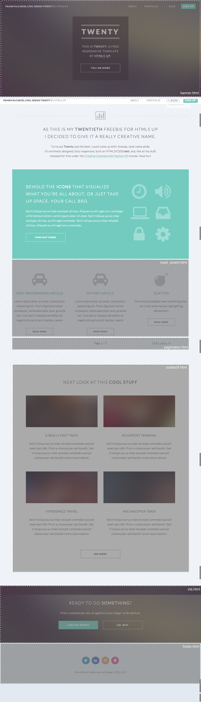

"Twenty" theme for Pelican
===================================
This is an adaptation of the [html5up](html5up.net) template "Twenty" for the Python static site generator [Pelican](http://docs.getpelican.com/).

I made this because I wanted to use it on my personal site [frankvalcarcel.com](frankvalcarcel.com) where you can also see a demo. Keep in mind I have made customizations to fit my tastes so if you like to see those please check out the branch: `frankvalcarcel.com`

 - The mercurial repo for this project: [bitbucket.org/frankv/twenty-pelican-html5up](https://bitbucket.org/frankv/twenty-pelican-html5up)

 - The repo for my site: [bitbucket.org/frankv/frankvalcarcel.com](https://bitbucket.org/frankv/frankvalcarcel.com)

This branch contains a close conversion of the original template. I'll add more here as I need it but for now, not included:
 - Layouts
 	- left-sidebar
 	- contact
 - Images

###Template Breakdown
---------------------
There are currently 12 templates:
```
├── archives.html 			// archive pages (right-sidebar)
├── article.html 				// article pages (no-sidebar)
├── banner.html 				// hero unit on index
├── base.html 				// all templates extend base, base contains head, body, and nav
├── category.html 			// category pages (right-sidebar)
├── coolstuff.html 			// gallery section on index
├── cta.html 					// call to action near footer of index and archives
├── footer.html 				// copyright and social icons
├── index.html 				// one-to-one for index of original
├── most_recent.html 			// three column most recent articles template
├── page.html 				// all pages (no-sidebar)
└── pagination.html
```

####Previews
 - index.html (extends base.html)



####Caveats
**1. skel.js**<br>
html5up uses [skel.js](http://skeljs.org/) to handle responsiveness of their templates. For skel to work right css has to be available at the `{{ SITEURL }}/css/` path. I did not want to alter any of the files in the template (**not even the init.js**). So to fix this for development my [fab](http://www.fabfile.org/) script copies over the css and js from the static folder and places them into their corresponding locations in my output directory.
Here's my fab script I call `collectstatic`:

```python
def collectstatic():
  if os.path.isdir(DEPLOY_PATH):
    local('mkdir -p {deploy_path}/css/ {deploy_path}/js/ {deploy_path}/fonts/ {deploy_path}/images/'.format(**env))
    local('cp -rf {theme_path}/twenty/static/css/* {deploy_path}/css/'.format(**env))
    local('cp -rf {theme_path}/twenty/static/js/* {deploy_path}/js/'.format(**env))
    local('cp -rf {theme_path}/twenty/static/fonts/* {deploy_path}/fonts/'.format(**env))
    local('cp -rf {theme_path}/twenty/static/images/* {deploy_path}/images/'.format(**env))
```

I just call it from my `build` and `rebuild` scripts and I'm good. On my production server I let the web server handle this.


**2. body classes**<br>
The original template uses a body class to specify the layout. This was a little tricky since for now I want to use two different layouts. For archive and category pages I wanted the right-sidebar layout, and for everything else, no-sidebar. The index class is implicit.

So to do this I had to write a little hack. Using a custom jinja filter I determine the type of page and then return the appropriate body class. In code it looks like this:<br>
```
<body class="{{ page_name|sidebar }} loading">
```

There's a number of different ways to include a custom defined jinja filter in your pelican project. [Here's the documentation for it](http://pelican.readthedocs.org/en/latest/settings.html?highlight=JINJA_FILTERS).<br>
And here's the filter code:
```python
def sidebar(value):
  if value.startswith('archives') or value.startswith('category'):
    return 'right-sidebar'
  elif value == 'index':
    return 'index'
  else:
    return 'no-sidebar'
```

**3. blog and submenus**<br>
I wanted to have a category submenu underneath a permanent blog menu item. This code is currently located at line 54 in base.html. How it works is for all my articles in their own category sub-folder, a submenu and subsequent category page are built. Have a look at my [pelicanconf.py](https://bitbucket.org/frankv/frankvalcarcel.com/src/8e74144acd94a7bebc51d20a4c729066dfe6537c/pelicanconf.py?at=default) file if it helps.<br>
This is how I structured my content directory:
```
├── blog						//standard articles
│   ├── article1.md
│   ├── article2.md
│   ├── article3.md
│   └── article4.md
├── pages
│   ├── about.md
│   └── portfolio.md
└── programming				//category
    └── article1.md
```

####To Do
[ ] Portfolio Category<br>
[ ] `coolstuff.html` will pull from portfolio category<br>
[ ] Add `Featured` and `FeaturedImage` attribute to content and templates<br>


============================
####Template Info
Twenty 1.0 by HTML5 UP<br>
html5up.net | @n33co<br>
Free for personal and commercial use under the CCA 3.0 license (html5up.net/license)


This is Twenty, a minimal, multi-page responsive site template for HTML5 UP.

As the name implies, this is my twentieth (!) design for HTML5 UP. Since the last
few have been single page affairs, I decided to go with something a bit more conventional
and threw in four extra page layouts. Beyond that, it's the usual drill: fully responsive,
built on HTML5/CSS3/skel, and CCA licensed like all my other stuff.

Special thanks to Michael Domaradzki (mdomaradzki.deviantart.com) for allowing me to
use his excellent photos in Twenty's demo*.

(* Not included with this download (replaced with generic placeholder images), as
I only have permission to use his work in my own on-site demos. Do NOT download
or use any of his work without prior explicit permission.)


AJ<br>
[n33.co](http://n33.co) [@n33co](http://twitter.com/n33co) [dribbble.com/n33](http://dribbble.com/n33)


####Credits
Icons
 - Font Awesome (http://fortawesome.github.com/Font-Awesome/)

Other
 - jQuery (jquery.com)
 - html5shiv.js (@afarkas @jdalton @jon_neal @rem)
 - background-size polyfill (https://github.com/louisremi/background-size-polyfill)
 - Misc jQuery plugins (n33.co)
 - skel (n33.co)